# NetFoundry Quick Start Guide

This Quick Start Guide is intended to provide an example of how Oracle Cloud Infrastructure users can quickly deploy NetFoundry Edge Router software within OCI. This quickstart template can be used to accelerate the deployment of NetFoundry Edge Routers into your tenancy with a customized Terraform deployment.

This quickstart guide will provide links to the repositories and associated documentation for deployment. The deployment scripts also include the implemnetation of a Load Balancer for NetFoundry network ingress for non-zitified hosts.

## Oracle Cloud with NetFoundry

With increased focus on zero trust architecture, Oracle partners with NetFoundry to help transform your network and set the foundation for your long-term work from anywhere and zero trust networking strategy. To understand NetFoundry’s implementation of the zero trust access from the NIST 800-207 standard, refer to this [whitepaper.](https://netfoundry.io/resources/netfoundry-and-nist-white-paper/)

On the heels of the Pandemic, NetFoundry continues to innovate for the Enterprise of the future with enhancements to our Work from Home platform and develop innovative solutions for connecting to Oracle Cloud Infrastructure (OCI). Your employees gain seamless connectivity to applications from anywhere, while advancing your overall security posture. Embed security and performance into your company’s core business applications. Policy-based access controls and micro-segmentation enable you to proactively manage all user connections, ensuring that employees, partners, and contractors can only access resources they’re entitled to and nothing else.

Because NetFoundry is offered as a service, organizations can realize the agility and flexibility benefits of zero trust networking access in a fraction of the time and cost of implementing traditional VPNs or SD-WAN solutions. Ultimately, NetFoundry can transform your networking infrastructure and accelerate employee productivity in the next phase. The NetFoundry software is staged within the OCI Marketplace for easy deployment within any customer OCI region.

The following graphic shows a sample cloud VCN with NetFoundry:
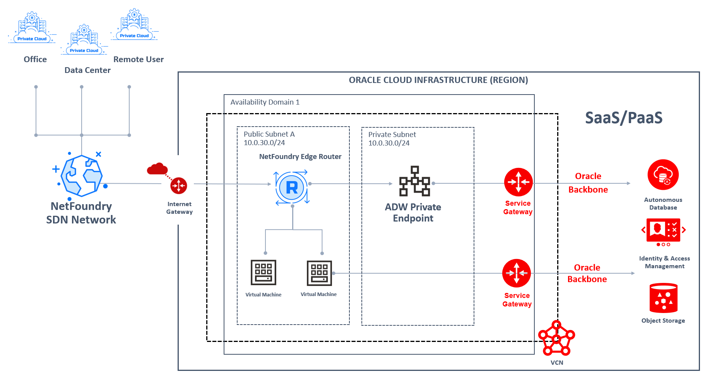

## Deploy the NetFoundry software in OCI for cloud connectivity

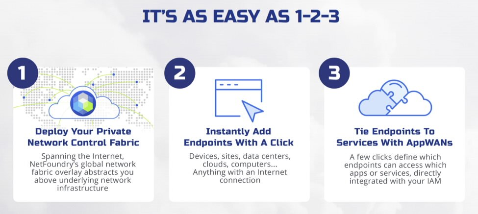

For more information on AppWANs and SDN overlay networking, see AppWAN 101: [What is overlay networking?](https://netfoundry.io/appwan-101-what-is-overlay-networking/)


## NetFoundry Platform Deployment

First off we'll need to do some pre deploy setup.  That's all detailed [here](https://github.com/oracle/oci-quickstart-prerequisites).


Next: Lets start with the NetFoundry Platform.

1. Sign up for NetFoundry Platform account [here](https://www.netfoundry.io/signup). The "Teams" account is free forever with some limitations to a single region and 10 endpoints. For this guide, we will be utilizing the NetFoundry orchestration platform. Once your account is created, administrators will have the ability to interact with the platform via API for all functions.

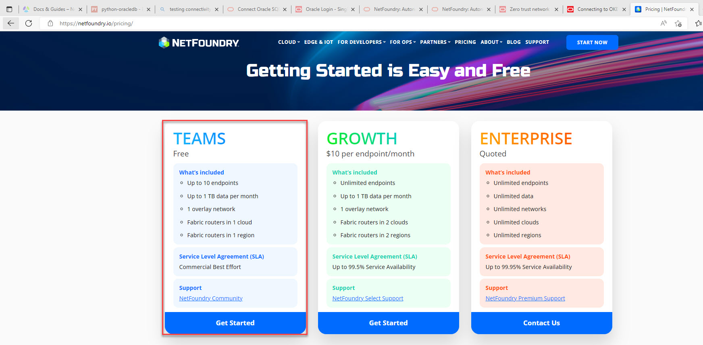

2. Once logged in, add a Network.The Network will be complete once the Globe in the upper left corner is Green.

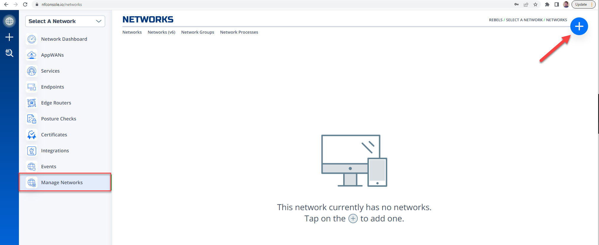

3. Add transit Edge Router. Name the Edge Router and give it an attribute of #transit, then select NetFoundry Hosted and select an OCI region where most users/resources are located and hit create. 

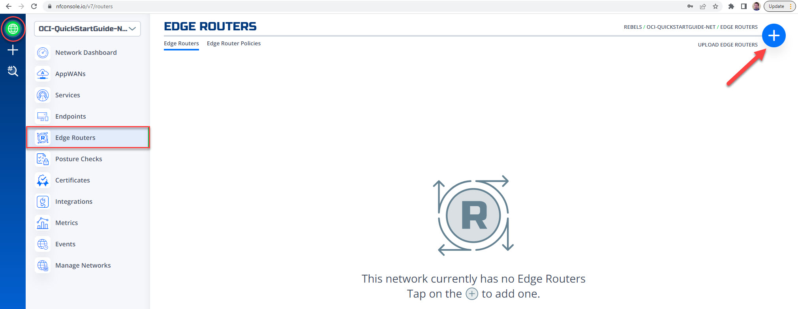
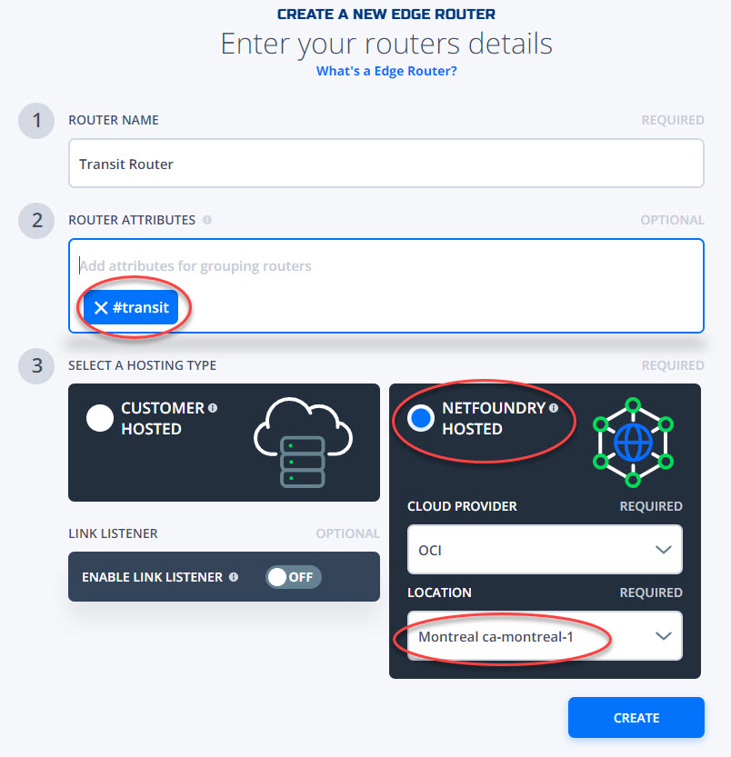

4. Add Edge Router Policy. Within the window, select the transit router from Step 3 and in the endpoints field type in #all and hit create.

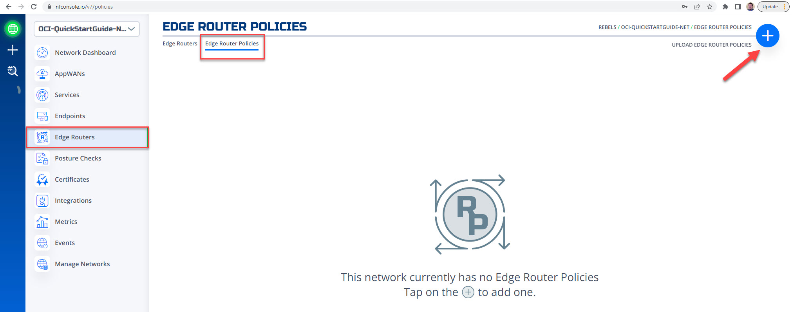
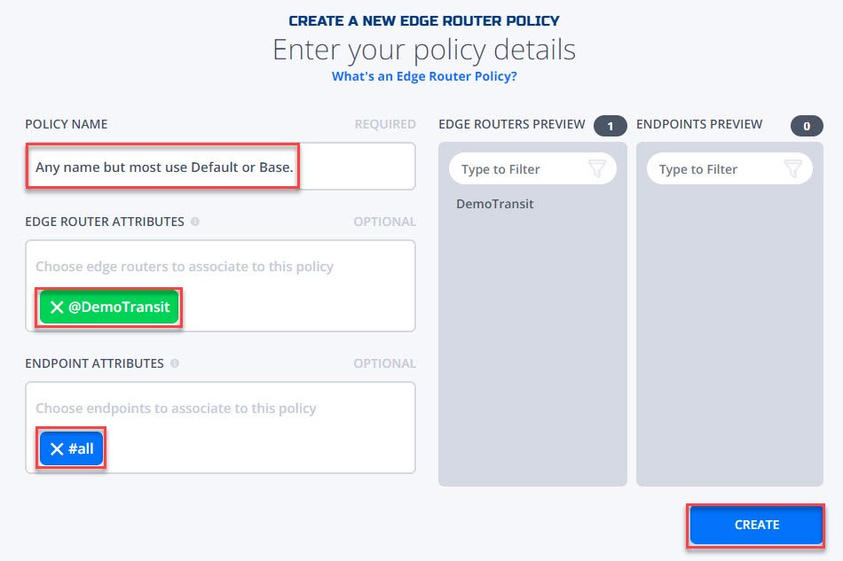

5. Next build 2 Customer Hosted Edge Routers within the NetFoundry Platform to be used for this quickstart guide. We will create 2 Edge Router identities for HA best practices and use them in our Terraform plan to deploy them to your OCI tenancy. Perhaps name them edgerouter-1-ha and edgerouter-2-ha. Once created you will record the key for each to be inserted into your Terraform plan.

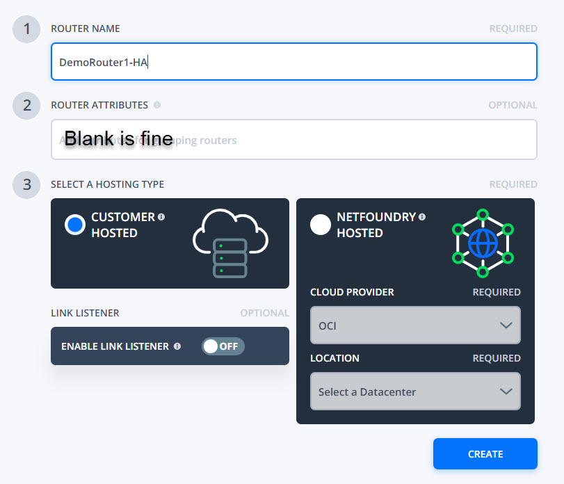
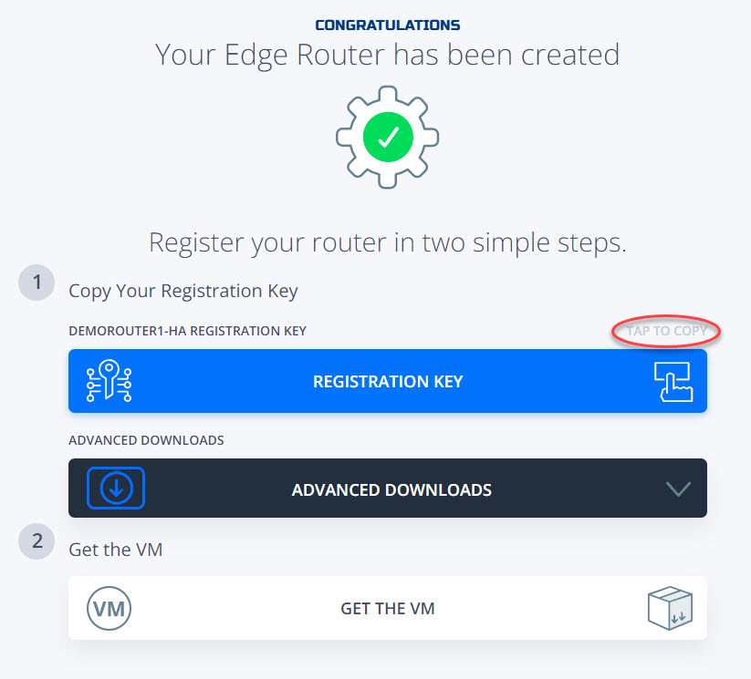

6. Once complete you should have:
    * A Network
    * 1 Transit Router and an Edge Router Policy with Transit Router and #all endpoints.
    * 2 Customer Routers
    
    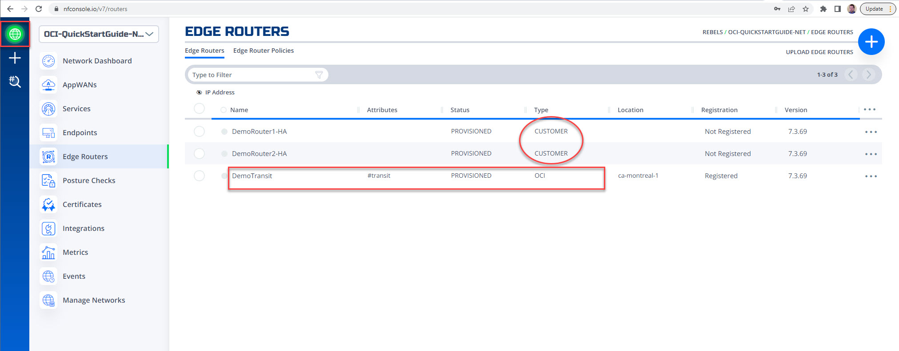
    
    
    
## Deploy NetFoundry Edge Routers into OCI VCN.

**Prerequisites**
* Terraform installed
* OCI Provider API Key Based Authentication
* **NOTE:** *if you are using a new dedicated CIDR for these resources. You will need to add the subnet to the Default Security List for Ingress. This will allow downstream hosts to Ingress the NetFoundry network via the HA Edge Routers installed in this guide.

**Steps**

1. Clone the repo and cd into the NetworkLoadBalancer/OCI directory

2. Update the oci-netfoundry/NetworkLoadBalancer/OCI/tf-provider/input_vars.tfvars.json file with your parameters

```h
vi tf-provider/input_vars.tfvars.json

{
    "region": "",
    "compartment_id": "",
    "nf_subnet_cidr": "",
    "vcn_name": "",
    "route_table_name": "",
    "nf_router_registration_key_list": []
}
```

3. Update the oci-netfoundry/NetworkLoadBalancer/OCI/tf-provider/provider.tf file with your OCI information

```h
vi tf-provider/provider.tf

provider "oci" {
  tenancy_ocid = "ocid for tenancy"
  user_ocid = "ocid for your oci user."
  private_key_path = "path to your private key e.g. /home/user/.oci/oci_api_key.pem"
  fingerprint = "user fingerprint"
  region = "desired region to place NetFoundry Edge Routers and Load Balancer"
}
```

4. For SSH access and management, You will need to update the path to the desired public key to deploy the NetFoundry Edge Routers. This can be edited in the tf-provider/root.tf file. 
```
vi tf-provider/root.tf
```


5. For the first deployment, you are required to initialize the terraform modules used by the template with  `terraform init` command:

```bash
$ terraform init

Initializing the backend...

Initializing provider plugins...
- Finding latest version of hashicorp/archive...
- Installing hashicorp/archive v2.1.0...
- Installed hashicorp/archive v2.1.0 (signed by HashiCorp)

Terraform has created a lock file .terraform.lock.hcl to record the provider
selections it made above. Include this file in your version control repository
so that Terraform can guarantee to make the same selections by default when
you run "terraform init" in the future.

Terraform has been successfully initialized!
```

6. You may now begin working with Terraform. Try running "terraform plan" to see any changes that are required for your infrastructure. 

```
terraform plan -var-file input_vars.tfvars.json
```
If you ever set or change modules or backend configuration for Terraform,
rerun this command to reinitialize your working directory. If you forget, other
commands will detect it and remind you to do so if necessary.

7. Next we will deploy the plan.
```
terraform apply -var-file input_vars.tfvars.json
```

8. To remove from OCI.
```
terraform destroy -var-file input_vars.tfvars.json
```
**NOTE:** *You will also need to delete the Edge Router constructs wfrom your NetFoundry console as the identity/registration key provided is one time use only.* 


Additional Documentation for complete end to end examples and deployment configurations.

[Oracle Blog - Establish connectivity to Oracle Autonomous Database with NetFoundry Zero Trust networking.](https://blogs.oracle.com/cloud-infrastructure/post/zero-trust-network-access-with-netfoundry)

[Oracle Blog -- Connecting to OKE private API with NetFoundry networking](https://blogs.oracle.com/cloud-infrastructure/post/connecting-to-oke-private-api-with-netfoundry-networking)

[Oracle Blog -- OpenZiti -- Information about NetFoundry open source version for public consumption](https://blogs.oracle.com/javamagazine/post/java-zero-trust-openziti)

[Oracle Docs -- NetFoundry: Autonomous Data Warehouse deployment on Oracle Cloud Infrastructure](https://docs.oracle.com/en/solutions/netfoundry-adw-on-oci/index.html)

[Oracle Docs -- Kubernetes integration on Oracle Cloud Infrastructure](https://docs.oracle.com/en/solutions/netfoundry-oke-on-oci/index.html)


[Oracle Live Labs -- NetFoundry Setup on OCI](https://apexapps.oracle.com/pls/apex/dbpm/r/livelabs/view-workshop?wid=829)

[Oracle Quickstart Guide -- (Coming soon!!!)](https://github.com/oracle-quickstart/oci-netfoundry)

[NetFoundry Live Labs on GitHub - Spin up Your Network](https://github.com/ojbfive/oci-naas-ztna-netfoundry)

[NetFoundry support guide -- How to use NetFoundry ZTNA platform with OCI.
](https://support.netfoundry.io/hc/en-us/articles/360055462471-Getting-started-with-NetFoundry-Zero-Trust-Networking-Oracle-example-setup-)

[NetFoundry support guide -- Configure NetFoundry Zero Trust Networking for Oracle Autonomous Database (ADW) private endpoint access.](https://support.netfoundry.io/hc/en-us/articles/360055772252-Configure-NetFoundry-Zero-Trust-Networking-for-Oracle-Autonomous-Database-ADW-private-endpoint-access-)

[NetFoundry support guide -- Deploy NetFoundry Edge Routers in OCI from Marketplace image in your own tenancy.](https://support.netfoundry.io/hc/en-us/articles/360054992952-Deployment-Guide-for-Oracle-Cloud-Edge-Routers)
