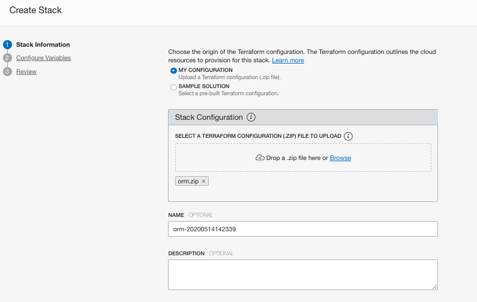

# NetFoundry Quick Start Guide

This Quick Start Guide is intended to provide an example of how Oracle Cloud Infrastructure users can quickly deploy NetFoundry Edge Router software within OCI. This quickstart template can be used to accelerate the deployment of NetFoundry Edge Routers into your tenancy with a customized Terraform deployment.

This quickstart guide will provide links to the repositories and associated documentation for deployment. The deployment scripts also include the implemnetation of a Load Balancer for NetFoundry network ingress for non-zitified hosts.

## Oracle Cloud with NetFoundry

With increased focus on zero trust architecture, Oracle partners with NetFoundry to help transform your network and set the foundation for your long-term work from anywhere and zero trust networking strategy. To understand NetFoundry’s implementation of the zero trust access from the NIST 800-207 standard, refer to this [whitepaper.](https://netfoundry.io/resources/netfoundry-and-nist-white-paper/)

On the heels of the Pandemic, NetFoundry continues to innovate for the Enterprise of the future with enhancements to our Work from Home platform and develop innovative solutions for connecting to Oracle Cloud Infrastructure (OCI). Your employees gain seamless connectivity to applications from anywhere, while advancing your overall security posture. Embed security and performance into your company’s core business applications. Policy-based access controls and micro-segmentation enable you to proactively manage all user connections, ensuring that employees, partners, and contractors can only access resources they’re entitled to and nothing else.

Because NetFoundry is offered as a service, organizations can realize the agility and flexibility benefits of zero trust networking access in a fraction of the time and cost of implementing traditional VPNs or SD-WAN solutions. Ultimately, NetFoundry can transform your networking infrastructure and accelerate employee productivity in the next phase. The NetFoundry software is staged within the OCI Marketplace for easy deployment within any customer OCI region.

The following graphic shows a sample cloud VCN with NetFoundry:


## Deploy the NetFoundry software in OCI for cloud connectivity


For more information on AppWANs and SDN overlay networking, see AppWAN 101: [What is overlay networking?](https://netfoundry.io/appwan-101-what-is-overlay-networking/)


## Local Development

First off we'll need to do some pre deploy setup.  That's all detailed [here](https://github.com/oracle/oci-quickstart-prerequisites).

Note, the instructions below build a `.zip` file from you local copy for use in ORM.
If you want to not use ORM and deploy with the terraform CLI you need to rename
`provider.tf.cli -> provider.tf`. This is because authentication works slightly
differently in ORM vs the CLI. This file is ignored by the build process below.

Make sure you have terraform v0.14+ cli installed and accessible from your terminal.

### Build

Simply `build` your package and follow the [Resource Manager instructions](https://docs.cloud.oracle.com/en-us/iaas/Content/ResourceManager/Tasks/managingstacksandjobs.htm#console) for how to create a stack.  Prior to building the Stack, you may want to modify some parts of the deployment detailed below.

In order to `build` the zip file with the latest changes you made to this code, you can simply go to [build-orm](./build-orm) folder and use terraform to generate a new zip file:

At first time, you are required to initialize the terraform modules used by the template with  `terraform init` command:

```bash
$ terraform init

Initializing the backend...

Initializing provider plugins...
- Finding latest version of hashicorp/archive...
- Installing hashicorp/archive v2.1.0...
- Installed hashicorp/archive v2.1.0 (signed by HashiCorp)

Terraform has created a lock file .terraform.lock.hcl to record the provider
selections it made above. Include this file in your version control repository
so that Terraform can guarantee to make the same selections by default when
you run "terraform init" in the future.

Terraform has been successfully initialized!

You may now begin working with Terraform. Try running "terraform plan" to see
any changes that are required for your infrastructure. All Terraform commands
should now work.

If you ever set or change modules or backend configuration for Terraform,
rerun this command to reinitialize your working directory. If you forget, other
commands will detect it and remind you to do so if necessary.
```

Once terraform is initialized, just run `terraform apply` to generate ORM zip file.

```bash
$ terraform apply

data.archive_file.generate_zip: Refreshing state...

Apply complete! Resources: 0 added, 0 changed, 0 destroyed.
```

This command will package the content of `simple` folder into a zip and will store it in the `build-orm\dist` folder. You can check the content of the file by running `unzip -l dist/orm.zip`:

```bash
$ unzip -l dist/orm.zip
Archive:  dist/orm.zip
  Length      Date    Time    Name
---------  ---------- -----   ----
     1140  01-01-2049 00:00   compute.tf
      680  01-01-2049 00:00   data_sources.tf
     1632  01-01-2049 00:00   image_subscription.tf
     1359  01-01-2049 00:00   locals.tf
    13548  01-01-2049 00:00   marketplace.yaml
     2001  01-01-2049 00:00   network.tf
     2478  01-01-2049 00:00   nsg.tf
      830  01-01-2049 00:00   oci_images.tf
     1092  01-01-2049 00:00   outputs.tf
       44  01-01-2049 00:00   scripts/example.sh
     4848  01-01-2049 00:00   variables.tf
      311  01-01-2049 00:00   versions.tf
---------                     -------
    29963                     12 files
```

### Deploy

1. [Login](https://console.us-ashburn-1.oraclecloud.com/resourcemanager/stacks/create) to Oracle Cloud Infrastructure to import the stack
    > `Home > Solutions & Platform > Resource Manager > Stacks > Create Stack`

2. Upload the `orm.zip` and provide a name and description for the stack


3. Configure the Stack. The UI will present the variables to the user dynamically, based on their selections. These are the configuration options:

> Compute Configuration

|          VARIABLE          |           DESCRIPTION                                                 |
|----------------------------|-----------------------------------------------------------------------|
|COMPUTE COMPARTMENT         | Compartment for Compute resources, including Marketplace subscription |
|INSTANCE NAME               | Compute instance name|
|DNS HOSTNAME LABEL          | DNS Hostname|
|COMPUTE SHAPE               | Compatible Compute shape|
|FLEX SHAPE OCPUS            | Number of OCPUs, only available for VM.Standard.E3.Flex compute shape|
|AVAILABILITY DOMAIN         | Availability Domain|
|PUBLIC SSH KEY STRING       | RSA PUBLIC SSH key string used for sign in to the OS|


 infrastructure. You typically start with a plan then run apply to create and make changes to the infrastructure. More details below:

|      TERRAFORM ACTIONS     |           DESCRIPTION                                                 |
|----------------------------|-----------------------------------------------------------------------|
|Plan                        | `terraform plan` is used to create an execution plan. This command is a convenient way to check the execution plan prior to make any changes to the infrastructure resources.|
|Apply                       | `terraform apply` is used to apply the changes required to reach the desired state of the configuration described by the template.|
|Destroy                     | `terraform destroy` is used to destroy the Terraform-managed infrastructure.|


```hcl


```
2. Modify [`oci_images.tf`](./oci_images.tf) set `marketplace_source_images` map variable to refer to the marketplace images your Stack will launch.

```

variable "marketplace_source_images" {
  type = map(object({
    ocid = string
    is_pricing_associated = bool
    compatible_shapes = list(string)
  }))
  default = {
    main_mktpl_image = {
      ocid = "ocid1.image.oc1..<unique_id>"
      is_pricing_associated = true
      compatible_shapes = []
    }
    #Remove comment and add as many marketplace images that your stack references be replicated to other realms
    #supporting_image = {
    #  ocid = "ocid1.image.oc1..<unique_id>"
    #  is_pricing_associated = false
    #  compatible_shapes = ["VM.Standard2.2", "VM.Standard.E2.1.Micro"]
    #}
  }
}

```

2. Run your tests using the Terraform CLI or build a new package and deploy on ORM.
